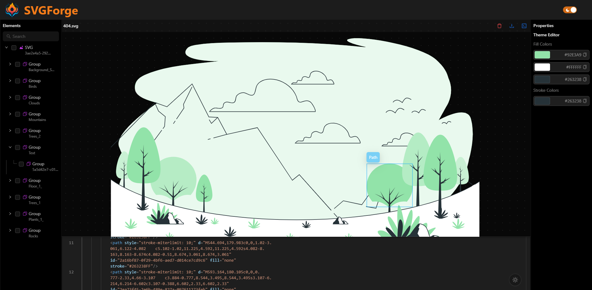
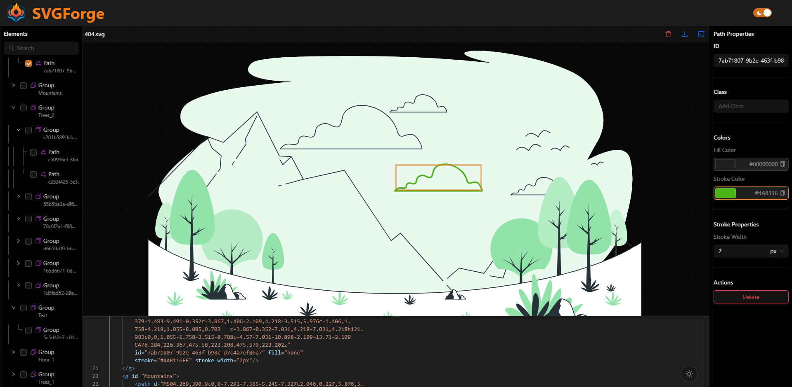
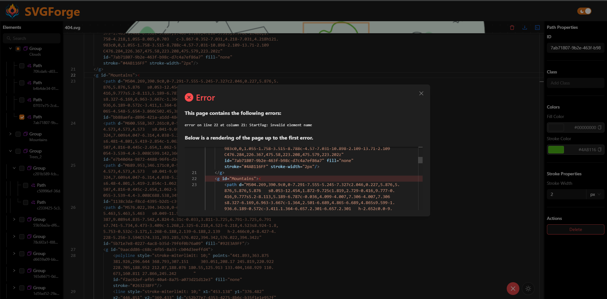
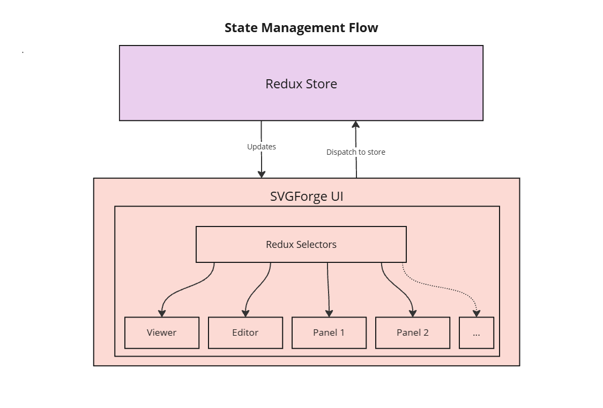

<h1 align="center">
   
  SVGForge - SVG Node Editor
</h1>

Demo: [SVGForge - SVG Node Editor](https://svgforge.vercel.app)

SVGForge is a SVG editor built using React and Redux for efficient state management. This editor was designed to modify SVG's to be used with code based animation libraries such as [GSAP](https://gsap.com/) and [React Spring](https://www.react-spring.dev/).

#### Features
- <b>SVG viewer:</b> A viewer that can inspect SVG paths, select paths for editing and has functionality such as zoom, pan, delete, undo, redo etc.
- <b>Code Editor:</b> An in-built code editor with detailed syntax and error handling.
- <b>Theme Editor:</b> View and customize the colors of the SVG at a global scale.
- <b>Tree Hierarchy Panel:</b> View the SVG paths as a tree with parent child relations.
- <b>Properties Panel:</b> View and modify properties such as colors, stoke width, ids, etc using the properties panel.

#### Preview

    
    

        SVGForge Editor with theme configuration
    

      
    
    

        Selected Path and Properties panel
    

      
    
    

        SVGForge error handling for invalid syntax
    

## Working

    
    

        State management using redux
    

SVGForge is built using [Redux toolkit](https://redux-toolkit.js.org/) for state management and a custom subscription react hook for state selectors, This allows only those components that are subscribed to a state value to receive state updates reducing the strain on component re-renderers thereby increasing performance.

`
const selectedNode = useSelector(state => state.selectedNode)
`

The code editor is built using Microsoft's [Monaco Editor](https://microsoft.github.io/monaco-editor/) with built-in intellisense and syntax colorization.

## Resources
- UI Library
  - Antd - https://ant.design
- Code Editor
  - Monaco editor - https://microsoft.github.io/monaco-editor
- State Management Library
  - Redux Toolkit - https://redux-toolkit.js.org
